# DevSecOps Workflow 

## Pull Request from Feature branch to Develop Environment

### Description

The GitHub Actions workflow is designed for automating tasks upon pull requests targeting the 'develop' branch, specifically for files within the 'core/**' path. It comprises several jobs: setting up a job matrix based on changed paths, timestamping, downloading a specified image scan utility, preparing directories for reports, and managing Docker image scans and configurations. Subsequent jobs involve merging scan reports, using a matrix to handle multiple tasks simultaneously, and finalizing with security scans and patching identified vulnerabilities in Docker images.

Insights:

Focuses on automation of tasks for specific pull requests.
Utilizes Docker and GitHub Actions for CI/CD pipelines.
Emphasizes security with vulnerability scanning and patching.
Matrix setup allows parallel processing of multiple paths.
Detailed Points:

a. The Essence (80/20):

Core Topics: GitHub Actions automation, Docker image scanning, and security patch management.
Automation: Automatically triggers on pull request events to 'develop' branch, ensuring tasks like security scans are performed early in the CI/CD pipeline.
Security: Implements scanning for vulnerabilities in Docker images and patches them if necessary, crucial for maintaining secure software.

b. The Action Plan:

Integrate GitHub Actions into development workflows to automate testing and deployment tasks.
Setup Docker environments for consistent testing and deployment scenarios.
Regularly update and scan Docker images to identify and patch vulnerabilities.
Use matrices for parallel execution to improve efficiency of the CI/CD pipeline.

### Flow Diagram 



```mermaid
flowchart TB
    trigger(Pull Request on 'develop' with 'core/**')
    trigger --> prepare_matrix[Prepare Matrix]
    prepare_matrix --> checkout_repo{Checkout Repository}
    checkout_repo --> get_changed_files(Get Changed Files)
    get_changed_files --> install_jq(Install jq)
    install_jq --> prepare_matrix_job(Prepare Matrix Job)
    prepare_matrix_job --> set_timestamp(Set Timestamp)
    set_timestamp --> download_utility(Download Image Scan Utility)
    download_utility --> create_timestamp_folder(Create Timestamp Based Folders)
    create_timestamp_folder --> upload_artifact(Upload Image Scan Utility as Artifact)
    upload_artifact --> dev_pr[Dev PR Job]
    dev_pr --> checkout_repo_dev{Checkout Repository in Dev}
    checkout_repo_dev --> download_artifact(Download Artifact)
    download_artifact --> read_json(Read JSON Config)
    read_json --> docker_image_scan(Docker Image Scan)
    docker_image_scan --> create_json_per_app(Create JSON File Per App)
    create_json_per_app --> generate_matrix(Generate Image Matrix)
    generate_matrix --> merge_scan_reports[Merge Scan Reports Job]
    merge_scan_reports --> download_all_artifacts(Download All Artifacts)
    download_all_artifacts --> display_structure(Display Structure of Downloaded Files)
    display_structure --> install_jq_merge(Install jq for Merge)
    install_jq_merge --> merge_all_reports(Merge All Reports)
    merge_all_reports --> use_matrix[Use Matrix Job]
    use_matrix --> checkout_repo_use{Checkout Repository in Use}
    checkout_repo_use --> use_matrix_job(Use Matrix)
    use_matrix_job --> install_cosign(Install Cosign)
    install_cosign --> setup_qemu(Set up QEMU)
    setup_qemu --> setup_docker_buildx(Set up Docker Buildx)
    setup_docker_buildx --> login_to_registry(Login to GitHub Container Registry)
    login_to_registry --> extract_docker_info(Extract Docker Image and Tag)
    extract_docker_info --> generate_trivy_report(Generate Trivy Report)
    generate_trivy_report --> archive_trivy_reports(Archive Trivy Reports)
    archive_trivy_reports --> check_vulnerability(Check Vulnerability Count)
    check_vulnerability --> run_copa_action(Run Copa Action)
    run_copa_action --> push_patched_image(Push Patched Image)
    push_patched_image --> write_modified_info(Write Modified Image Info if Patched)
    write_modified_info --> sign_image(Sign Image with Key)
    sign_image --> comment_pr(Comment PR)

```

## Pull Request Merge Workflow from Feature to Develop

### Description

Summary:
This  GitHub Actions workflow is used for merging pull requests into the 'develop' branch only if they have been merged. The workflow includes jobs to configure Git settings, automatically generate release notes and tags using Google's Release Please action, and handle package releases and matrix construction for further operations. The workflow facilitates automated configuration management and deployment tasks, such as installing necessary tools (Helm, Cosign), updating Helm charts, and pushing them to GitHub's Container Registry (GHCR). The process is contingent on successful merges and is designed to streamline the integration and deployment processes in a CI/CD pipeline.

Insights:

Automates release tagging and notes generation using Google's Release Please.
Deploys updates using Helm and pushes to GHCR, ensuring up-to-date deployments.
Securely signs packages using Cosign to maintain integrity and trust.
Matrix-based job handling optimizes parallel task executions.
Detailed Points:

a. The Essence (80/20):

Core Topics: Automated CI/CD pipelines, GitHub Actions for release management, security with Cosign, and Helm for package management.
Automated CI/CD: Ensures that only merged pull requests trigger deployment processes, enhancing the workflow's reliability and automation.
Package Security and Integrity: Uses tools like Cosign for signing to secure releases, crucial for preventing unauthorized alterations.
b. The Action Plan:

Implement CI/CD pipelines using GitHub Actions to automate integration and deployment tasks.
Use Release Please for automated change log generation and version tagging to keep track of development progress.
Employ Helm for managing Kubernetes applications, ensuring consistent and reliable deployments.
Integrate Cosign to sign and verify artifacts, bolstering security protocols.

### Flow Diagram

```mermaid
flowchart TD
    start(Pull Request Closed on 'develop') --> check_if_merged{Check if Merged}
    check_if_merged -- Yes --> dev_pr_merge[Dev PR Merge Job]
    check_if_merged -- No --> end(End Process)
    
    dev_pr_merge --> checkout_repo{Checkout Repository}
    checkout_repo --> configure_git(Configure Git)
    configure_git --> release_please(Release Please Action)
    release_please --> create_matrix(Create Matrix for Release)
    
    create_matrix --> release_matrix[Release Matrix Job]
    release_matrix --> checkout_repo_release{Checkout Repository for Release}
    checkout_repo_release --> install_helm(Install Helm)
    install_helm --> configure_git_release(Configure Git for Release)
    configure_git_release --> install_cosign(Install Cosign)
    install_cosign --> install_yq(Install yq)
    install_yq --> get_chart_info(Get Chart Name and Version)
    get_chart_info --> read_json_config(Read JSON Config)
    read_json_config --> add_dependencies(Add Dependencies)
    add_dependencies --> helm_login(Helm | Login to GHCR)
    helm_login --> package_helm_chart(Helm | Package Helm Chart)
    package_helm_chart --> push_helm_chart(Helm | Push Helm Chart to GHCR)
    push_helm_chart --> login_docker(Login to GitHub Container Registry)
    login_docker --> sign_image(Cosign | Sign Image with Key)
    sign_image --> end
```
