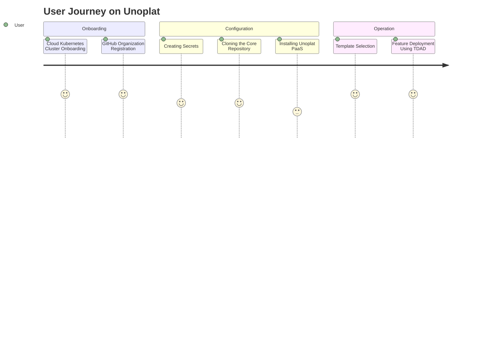

# The Problem
https://github.com/unoplat

# The Solution
Launch SAAS exponentially faster and better through  vetted and tested multi layered approach consisting of IAC(Infrastructure as a code), PAAS(platform as a service) and TBAD (Template based application Development).

# Current Progress

## Distributed Generic DevSecOps

[DevSecOps](https://github.com/unoplat/unoplat/blob/develop/.github/devSecOps.md)

### End Goal for Distributed Generic DevSecOps:
SLSA 3

## IAC through Gitops (current progress)

Pulumi and github action based Intuitve IAC coming soon! Check Roadmap

# Roadmap

[Project Roadmap](https://github.com/orgs/unoplat/projects/5)

Look for TODO/IN Progress columns.

# Tech Stack:

## DevSecOps 

### CI/CD & Server Orchestration
- **GitHub Actions**: Automate your software workflows with CI/CD that works with GitHub repositories. [GitHub Actions](https://github.com/features/actions)
- **Nektos/act**: Run your GitHub Actions locally for development with Nektos. [Nektos Act](https://github.com/nektos/act)

### Security Scanning
- **Trivy**: A simple and comprehensive vulnerability scanner for containers and other artifacts, designed to be easy to use. [Trivy](https://aquasecurity.github.io/trivy/)
  - Container Images
  - Filesystems
  - Git repositories (remote)
  - Kubernetes clusters or resources
- **Copaceptic**: Automatically patch container images without depending on upstream sources. [Learn more](https://example.com/copaceptic)
- **Cosign**: Tool for signing containers to ensure the integrity of data within the supply chain. [Cosign by Sigstore](https://github.com/sigstore/cosign)
- **Pulumi**: Modern Infrastructure as Code using real languages. [Pulumi](https://www.pulumi.com/)

## Observability
- **Signoz**: Open-source application performance monitoring tool that helps developers monitor their applications & troubleshoot problems. [Signoz](https://signoz.io/)

## API Security
- **Ambassador**: Open-source Kubernetes-native API Gateway for microservices built on the Envoy Proxy. [Ambassador](https://www.getambassador.io/)
- **Linkerd**: Ultralight service mesh for Kubernetes. Provides runtime debugging, observability, reliability, and security without requiring configuration. [Linkerd](https://linkerd.io/)
- **Cert Manager**: Automatically manage and renew SSL/TLS certificates in Kubernetes. [Cert Manager](https://cert-manager.io/)
- **SuperTokens**: Open-source alternative to Auth0, Firebase Auth and others. Handles user authentication and authorization. [SuperTokens](https://supertokens.io/)

## Fault Tolerance
- **Velero**: Backup and restore, disaster recovery, Kubernetes migrations. [Velero](https://velero.io/)

## Infrastructure as Code (IAC)
- **Core Unoplat IAC**: Utilize GitOps principles for deployment across environments (development, staging, production) using Pulumi in a Golang SDK. [Pulumi with Golang](https://www.pulumi.com/docs/intro/languages/go/)

## Application Frameworks
- **TDAP (Template Driven Application Development)**
  - **BPMN Framework**: Framework for building and visualizing business processes. [BPMN](https://bpmn.io/)
- **Serverless Framework**: Build applications on AWS Lambda, Azure Functions, Google Cloud Functions, and more. [Serverless](https://www.serverless.com/)
- **KNative**: Kubernetes-based platform to build, deploy, and manage modern serverless workloads. [KNative](https://knative.dev/)
- **Microservice Framework - Quarkus**: Supersonic Subatomic Java. [Quarkus](https://quarkus.io/)
- **Streaming/Batch Framework - Apache Flink**: Stateful computations over data streams. [Apache Flink](https://flink.apache.org/)

## Documentation & Diagrams
- **Mermaid**: Generation of diagram and flowchart from text in a similar manner as markdown. [Mermaid](https://mermaid-js.github.io/mermaid/)
- **PlantUML**: Open-source tool allowing users to create diagrams from a plain text language. [PlantUML](https://plantuml.com/)
- **Markdown**: Lightweight markup language with plain text formatting syntax. [Learn Markdown](https://www.markdownguide.org/)

# Contribution Guidelines

Coming Soon

# Unoplat User Workflow
# Detailed User Workflow Documentation for Unoplat

## Introduction
This guide details the user workflow on Unoplat, demonstrating step-by-step interactions from initial onboarding to feature deployment. Unoplat provides a streamlined, secure, and efficient pathway for deploying cloud-native applications using Kubernetes and GitOps principles.

## User Workflow Overview
The workflow on Unoplat is designed to guide users through a series of intuitive steps, ensuring a smooth transition from setup to full-scale operation.

### Stage 1: Onboarding
- **Cloud Kubernetes Cluster Onboarding**: Users begin their journey by onboarding onto cloud Kubernetes clusters (based on development,staging and production environments).
- **GitHub Organization Registration**: Subsequently, users register their GitHub organization to integrate their existing workflows and repositories with Unoplat.

### Stage 2: Configuration
- **Secrets Management**:
  - **Creating Secrets**: Essential secrets such as certificates, private keys for Cosign, and `kubeconfig` etc files are created within the GitHub organization. This step ensures that all communications and operations are secured and authenticated.
- **Repository Setup**:
  - **Cloning the Core Repository**: Users clone the Unoplat core repository to their local environment to start the setup process.
  - **Installing Unoplat PaaS**: The Platform as a Service (PaaS) component is installed on the Kubernetes cluster through a GitOps-driven approach. This method leverages version control to automate deployment and updates. This will ensure all  core components of unoplat are installed/updated seamlessly.

### Stage 3: Operation
- **Application Deployment**:
  - **Template Selection**: Users select from a variety of predefined Unoplat application templates. These templates are designed to cover diverse operational needs and feature sets.
  - **Feature Deployment Using TDAD**:
    - **TDAD Approach**: The Template Driven Application Development (TDAD) approach is employed to deploy features efficiently. This approach facilitates rapid application development and deployment by using customizable templates that can be tailored to specific business requirements.

